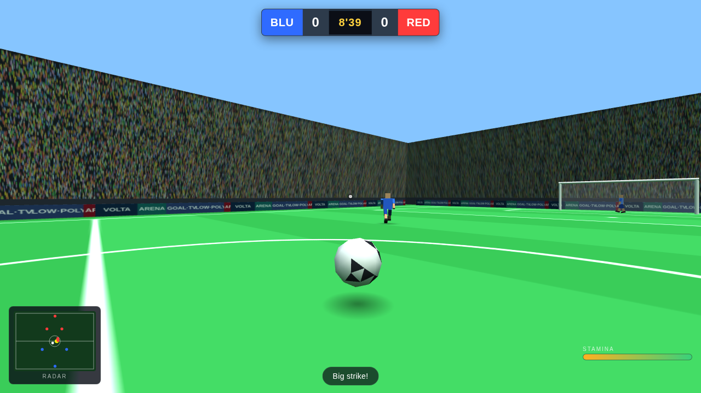

# Low-Poly Volta — First-Person Soccer ⚽

A first-person, low-poly arcade football game — think **FIFA / Volta**, but you
play through the eyes of a single striker on the pitch. Built as a **self-contained
browser game** using [Three.js](https://threejs.org/) (vendored, no build step,
no internet required). Just open `web/index.html` and play.



## ▶ How to play

Open **`web/index.html`** in any modern desktop browser (Chrome, Edge, Firefox).
No server, no install, no dependencies to download — everything is bundled.

> Tip: if your browser is strict about `file://`, run a tiny static server from
> the `web/` folder instead, e.g. `python3 -m http.server` then visit
> `http://localhost:8000`.

Click the pitch to lock the mouse and kick off.

### Controls

| Action | Input |
|--------|-------|
| Move | **W A S D** (or arrow keys) |
| Look / aim | **Mouse** |
| Sprint | **Shift** (drains stamina) |
| Shoot | **Hold Left-Click** to charge power, release to strike |
| Pass | **Right-Click** or **F** (auto-aims to the best teammate) |
| Sprint tackle | **Space** (a short burst to win the ball) |
| Pause | **Esc** |
| Replay (at full time) | **Enter** |

You are the **striker** — the **yellow dot** on the radar. Outscore the RED team
before the 90' clock runs out.

## Features

- **True first-person** — the camera is your player's eyes; look down and you see
  your own boots and the ball at your feet.
- **Low-poly aesthetic** — flat-shaded footballers, a classic panelled ball,
  procedurally-drawn pitch markings, sponsor boards and a full crowd — all
  generated at runtime, zero external assets.
- **Arcade ball physics** — gravity, bounce, rolling friction, goal-post
  rebounds and futsal-style perimeter boards that keep play flowing.
- **Soft dribbling** — the ball stays glued just ahead of your feet as you run,
  and a well-timed run steals it straight off an opponent.
- **Charged shooting & smart passing** — hold to power up a strike; passes
  auto-pick the most dangerous open teammate.
- **5-a-side AI** — outfield players chase, support, mark and defend based on
  possession, plus a goalkeeper that tracks the ball and rushes out to clear.
- **Full match loop** — kickoff, live match clock, goal detection, celebration,
  restart from the centre spot, full-time result and instant replay.
- **Broadcast HUD** — scoreboard, match clock, live radar/minimap, stamina and
  shot-power meters, and a commentary ticker.

## Project structure

```
web/
├── index.html              ← entry point (loads Three.js + the game scripts)
├── css/style.css           ← HUD / overlay styling
├── vendor/three.min.js     ← Three.js r128 (MIT), vendored for offline play
└── js/
    ├── util.js             ← config constants + math helpers
    ├── textures.js         ← procedural canvas textures (pitch, crowd, ads)
    ├── world.js            ← scene, lights, pitch, goals, stadium
    ├── ball.js             ← ball mesh + arcade physics
    ├── player.js           ← humanoid mesh, running animation, movement + AI
    ├── input.js            ← keyboard, pointer-lock mouse look, shot charging
    ├── hud.js              ← DOM HUD + radar rendering
    └── game.js             ← match orchestration: possession, rules, camera
```

The scripts are plain (non-module) so the game runs straight from `file://`.
Top-level classes are shared across files via the global lexical scope, so load
order in `index.html` matters.

## Tuning

Most of the feel lives in `web/js/util.js` under `CFG` — pitch size, player
speeds, ball physics, control radius, team size and match length are all there.
Team colours/names are in `CFG.colors`.

---

*Note: this repository previously hosted a Roblox sword-fighting prototype; those
files remain under `src/` for reference but are unrelated to the soccer game.*
